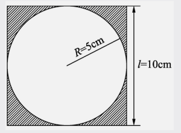

# 巧用数学解决阴影问题

初学圆形的时候，通常我们都会遇到和圆的面积有关的问题。

如下图，它外接了一个长度为10cm的正方形，求在正方形的内部并且在圆的外部的区域为阴影的面积。



对于阴影部分面积，按照做数学题的逻辑，我们会先分别计算出圆的面积和正方形的面积，再用正方形的面积减去圆的面积即可。

计算过程用数学步骤可以写成：

$ S\_1 = \pi R^2 = 25 \pi \approx 78.5\(cm^2\)$

$ S\_2 = 10 \times 10 = 100\(cm^2\) $

$ S = S\_2 - S\_1 = 100 - 78.5 = 21.5\(cm^2\) $

我们设定圆周率如上面计算中为$\pi=3.14$，在Python中，使用float\(\)浮点函数来创建这样的数就叫浮点数。

使用Python语句在IDLE中直接运行，如下：

```python
>>> R = 5
>>> L = 10
>>> S = L ** 2 - 3.14 * (R ** 2)
>>> print(S)
21.5
>>>
```

如果想使用更加精确的$\pi$，我们可以尝试导入math模块。

可以在IDLE中直接导入

```python
>>> import math
>>> math.pi
3.11592653589793
>>>
```

这样可以更加精确的使用$\pi$：

```python
>>> import math
>>> R = 5
>>> L = 10
>>> S = L ** 2 - math.pi * (R ** 2)
>>> print(S)
21.46018366025517
>>>
```

